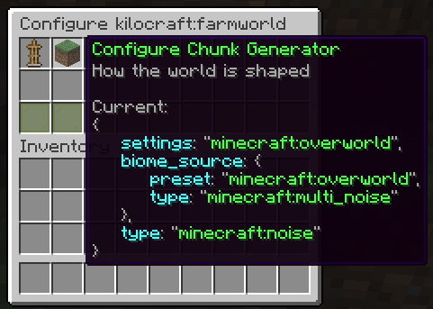

# WorldManager
Create and manage worlds in-game, through commands.

## Commands
The main command is `/worldmanager`. It has a shorter alias `/wm`.

- `/wm` opens an overview gui of all custom worlds that have been created through this mod
- `/wm delete <id>` deletes the specified world, kicking all players that are currently in it
- `/wm tp <id> [<targets>]` teleports to the specified world to the players last location.

### Create
`/wm create <id>` opens a gui where you can configure your world (dimension type, chunk generator and seed)

`/wm create <id> <nbt>` allows you to create a world without using the gui (advanced). `{seed: 0L, generator: {biome: "minecraft:the_void", type: "fantasy:void"}, type: "minecraft:overworld"}` could be used to create a void world.

### Import
`/wm create <id> <file>` allows you to import a world from a zip or rar archive, or from a folder.

### Spawn
`/wm setspawn` sets the world spawn of the current world to your position.

`/wm spawn <id> [<targets>]` teleports to the specified world spawn. If the spawn point is not set, it uses the vanilla spawn point logic.

The file / folder needs to contain a valid `level.dat` file.
This will import the overworld dimension of the given world.

_Powered by [fantasy](https://github.com/nucleoidmc/fantasy) <3_